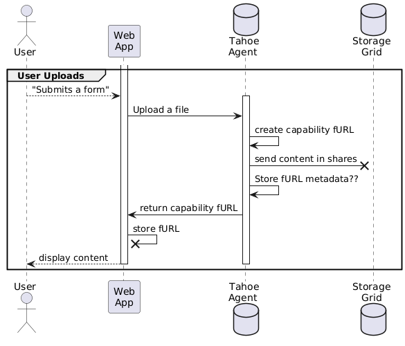
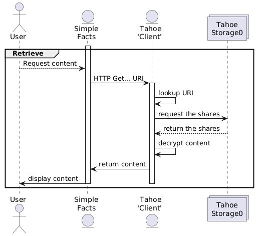

==============
Private Facts
==============

.. pull-quote::
    The three rules of storing data for other people:
        * Don't lose the data
        * Don't let the wrong people see it.
        * Don't forget the first two rules.

Private Facts aims to be the the mega tutorial to learn how a developer can interact with Tahoe-lafs from a user-facing application.
This series of steps will cover the following milestones:

    * create a local Tahoe-LAFS dev environment
    * use the CLI to send some text and some files
    * use the WebAPI to send some text and some files (examples with Python and curl)
    * refactor a simple FastAPI app to connect to Tahoe-LAFS
    * use Tahoe-LAFS as a backing store for that simple FastAPI app
    * integrate a more complex data model from the FastAPI using SQLite and Tahoe-LAFS

What happens when you use Private Facts?
========================================

Saving content using the Tahoe backing store
---------------------------------------------

Retrieving content from the Tahoe backing store:
------------------------------------------------

.. toctree::
    :maxdepth: 1

    tutorials/index
    faq
    glossary

Team Internal notes
===================

.. toctree::
    :titlesonly:

    decisions
    cases